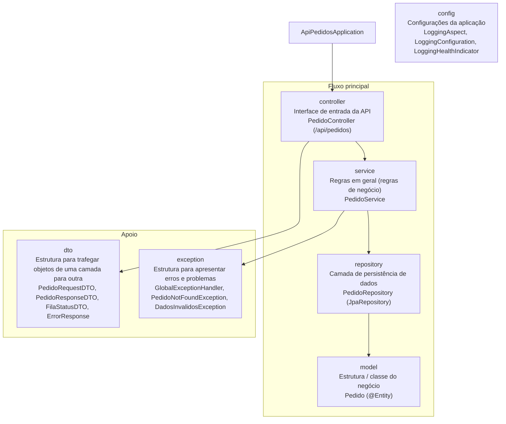

# Estrutura de pacotes

Pacote raiz: `com.example.apipedidos`

```mermaid
flowchart TB
    App["ApiPedidosApplication"]

    subgraph principal["Fluxo principal"]
        direction TB
        controller["controller<br/>Interface de entrada da API<br/>PedidoController (/api/pedidos)"]
        service["service<br/>Regras em geral (regras de negócio)<br/>PedidoService"]
        repository["repository<br/>Camada de persistência de dados<br/>PedidoRepository (JpaRepository)"]
        model["model<br/>Estrutura / classe do negócio<br/>Pedido (@Entity)"]
        controller --> service --> repository --> model
    end

    subgraph apoio["Apoio"]
        dto["dto<br/>Estrutura para trafegar objetos de uma camada para outra<br/>PedidoRequestDTO, PedidoResponseDTO, FilaStatusDTO, ErrorResponse"]
        exception["exception<br/>Estrutura para apresentar erros e problemas<br/>GlobalExceptionHandler, PedidoNotFoundException, DadosInvalidosException"]
    end

    config["config<br/>Configurações da aplicação<br/>LoggingAspect, LoggingConfiguration, LoggingHealthIndicator"]

    App --> controller
    controller --> dto
    service --> exception
```
